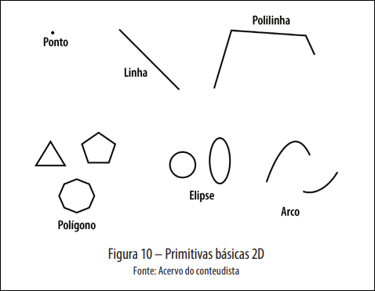
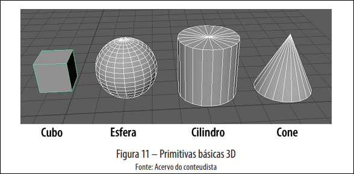

# 1 Conceitos Fundamentais

## Áreas da Computação Gráfica

- Análise de imagens;
- Síntese de imagens;
- Processamento de imagens.

## Imagem Digital

Uma imagem pode ser definida como uma função bidimensional $f(x,y)$, em que x e y são as coordenadas espaciais e a amplitude de $f$ em qualquer par de coordenadas $(x,y)$ é chamada de **intensidade** ou **nível** de cinza da imagem nesse ponto.

Quando x, y e os valores de intensidade são quantidades finitas e discretas, dizemos que temos uma **imagem digital**.

## Pixel

Uma imagem é composta por um número finito de elementos que possuem coordenada e um valor de intensidade, sendo chamados de **elementos pictóricos**, **elementos de imagem**, **pels** ou o mais comum: **pixel**. A menor unidade dentro de uma imagem.

## Espaços de Cores

Os modelos de cores ou espaços de cores permitem a especificação de cores em um formato padronizado para atender a diferentes dispositivos gráficos ou aplicações que requerem a manipulação de cores.

### Modelos de Cores

- **RGB**: _Red, Green, Blue_. Formato somatório das cores onde a junção de todas forma o branco;
- **CMY**: _Cyan, Magenta, Yellow_. Formato subtrativo das cores onde a junção de todas forma preto. Formado pelas cores secundárias do modelo **RGB**. Utilizado para materiais impressos.

#### Representação Hexadecimal

Uma forma de representar o modelo **RGB** utilizando 6 letras ou números para representar os 3 canais. Utiliza-se o sistema de numeração em base 16, o hexadecimal.

A intensidade de cada canal RGB varia de 0 a 255 na base decimal e de 00 a FF na base hexadecimal, resultando nos 6 dígitos necessários para representar cada canal de cor.

## Sistemas de Imagens Digitais

### Processamento de Imagens

Conhecido como **PDI**, Processamento Digital de Imagens. Trata-se de dados de entrada e saídas das funções de desenho.

Considerando os _pixels_ como valores numéricos que equivalem à intensidade da cor em um ponto específico do plano ou espaço, podemos aplicar uma série de funções matemáticas que modificam tal valor com base em uma certa regra. Exemplos disso são: diminuição de ruídos, realce de cores, restauração de imagens, entre outros.

Um processo simples é converter uma imagem colorida para apenas tons de cinza. Um tom de cinza existe quando os valores dos três canais RGB são iguais, assim, para tornar a imagem em tons de cinza, basta fazer a média dos valores em cada _pixel_.

$$f(x,y) = \frac{PR + PG + PB}{3}$$

Em que:

- **PR**: componente vermelho do _pixel_ no ponto $P(x,y)$;
- **PG**: componente verde do _pixel_ no ponto $P(x,y)$;
- **PB**: componente azul do _pixel_ no ponto $P(x,y)$.

### Análise de Imagens

Essa área está ligada à interpretação de imagens. A entrada do algoritmo é uma imagem, e a saída é tida em outro formato, dados.

**Visão computacional** é o processo de modelagem e replicação da visão humana usando software e hardware (_DATA SCIENCE ACADEMY_, 2018).

### Síntese de Imagens

A síntese de imagens é o oposto da análise. Ela transforma dados em imagens, que podem ser vetoriais ou matriciais, tais como imagens médicas de ressonância magnética, ultrassom e tomografias, por exemplo.

Um bom exemplo seria a análise de uma tabela de excel para gerar um gráfico a partir dos dados.

## Pipeline de Renderização

Renderização é o processo de criar a imagem que deve ser apresentada ao usuário em um dispositivo como um monitor, por exemplo. É composto de outros processos bem definidos que se relacionam a alguma das áreas da computação gráfica que aqui comentamos.

Esse processo lida com processos via _software_ que devem ser convertidos para o _hardware_, como acender um Light Emitting Diode (LED).

A partir disso vem o _pipeline_, uma sequência de ações que analisam a informação, aplica transformações matemáticas necessárias e envia para o hardware as instruções claras.

## Primitivas

São os elementos gráficos mais simples que podem ser utilizados para o desenho em uma aplicação. São diretamente relacionadas a modelos matemáticos básicos. Com elas é possível criar qualquer outra forma de desenho.

### Primitivas 2D

### Primitivas 3D

