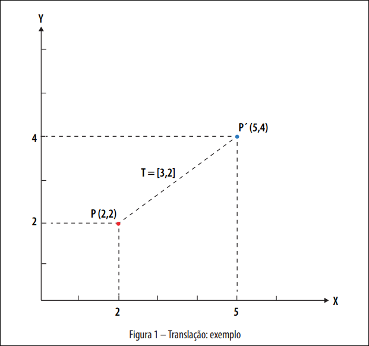
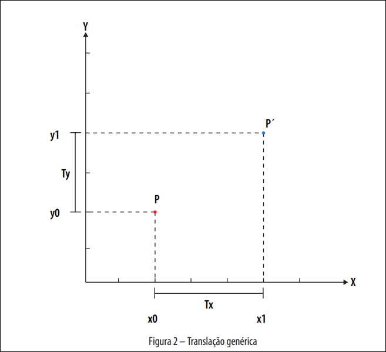
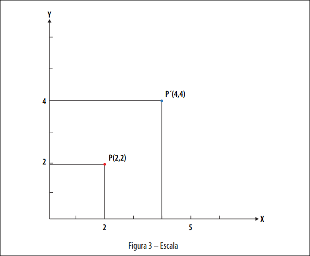
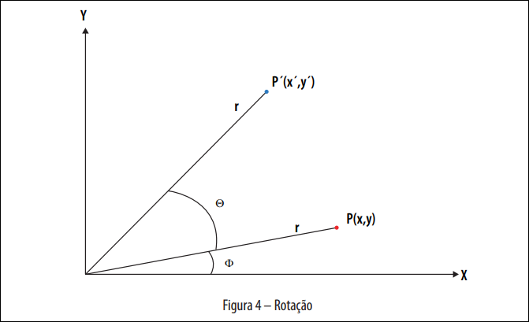

# Transformações Geométricas

## Transformações Geométricas

Conceito de transformada: alterar um gráfico em outro aplicando regras bem definidas.

Abordado com regras como modelos matemáticos, relacionados à translação, rotação, escala e inclinação.

Quando tratamos de transformações no Plano, são chamadas Transformadas 2D.

Basicamente, estamos observando um ponto pertencente à primitiva e calculando sua nova posição no plano ou espaço.

### Translação

Translação é mover um ponto no plano XY por meio da adição de um determinado valor à sua posição original.

$$P(2,2) + T[3,2] = P'(3+2,2+2) = P'(5,4)$$

Pela análise do gráfico, podemos dizer que:

$$
x1 = x0 + Tx
$$

$$
y1 = y0 + Ty
$$

E para formalizarmos essas operações, podemos escrevê-las de acordo com a notação matricial:

$$
\begin{bmatrix}
x1 \\
y1
\end{bmatrix}
=
\begin{bmatrix}
x0 \\
y0
\end{bmatrix}
+
\begin{bmatrix}
Tx \\
Ty
\end{bmatrix}
$$

Com essa operação, podemos, então, representar uma translação genérica para obter a coordenada de um ponto trasladado.

Portanto, a matriz de transformação de translação é igual a:

$$
T = \begin{bmatrix}
Tx \\
Ty
\end{bmatrix}
$$

### Escala

Fazendo uma análise análoga para a escala, temos que é uma transformação onde é feita uma multiplicação por um valor.

Assim, o fator de escala seria 2, para todos os eixos. Mas podemos usar, ainda, um fator de escala diferente para cada eixo.

Então, podemos dizer que:

$$
\begin{bmatrix}
x1 & y1
\end{bmatrix}
=
\begin{bmatrix}
x0 & y0
\end{bmatrix}
*
\begin{bmatrix}
Sx & 0 \\
0 & Sy
\end{bmatrix}
$$

Assim, temos que:

$$
x1 = Sx * x0
$$

$$
y1 = Sy * y0
$$

Portanto, a matriz de transformação de escala é igual a:

$$
S = \begin{bmatrix}
Sx & 0 \\
0 & Sy
\end{bmatrix}
$$

### Rotação

O Processo de rotação envolve mais passos, mas pode ser interpretado por meio da Geometria Analítica e da Trigonometria.

Na figura acima, temos a representação dessa transformação espacial. O ponto $P(x,y)$ é o ponto original que queremos rotacionar. Perceba, ainda, que existe uma distância $r$ (raio) entre ele e a origem e um ângulo $\phi$ entre esse raio e o eixo X.

O objetivo é aplicar uma rotação de um ângulo $\theta$ a esse ponto específico, mantendo a distância entre o novo ponto e a origem.

#### Coordenadas Polares
