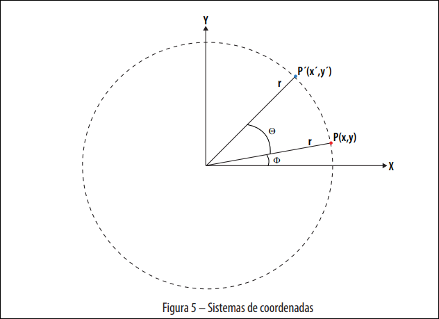
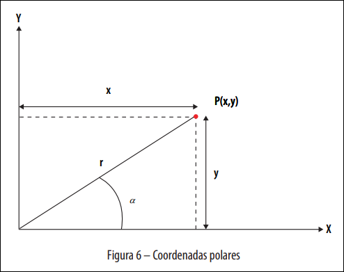

# Transformações Geométricas

## Transformações Geométricas

Conceito de transformada: alterar um gráfico em outro aplicando regras bem definidas.

Abordado com regras como modelos matemáticos, relacionados à translação, rotação, escala e inclinação.

Quando tratamos de transformações no Plano, são chamadas Transformadas 2D.

Basicamente, estamos observando um ponto pertencente à primitiva e calculando sua nova posição no plano ou espaço.

### Translação

Translação é mover um ponto no plano XY por meio da adição de um determinado valor à sua posição original.

$$P(2,2) + T[3,2] = P'(3+2,2+2) = P'(5,4)$$

Pela análise do gráfico, podemos dizer que:

$$
x1 = x0 + Tx
$$

$$
y1 = y0 + Ty
$$

E para formalizarmos essas operações, podemos escrevê-las de acordo com a notação matricial:

$$
\begin{bmatrix}
x1 \\
y1
\end{bmatrix}
=
\begin{bmatrix}
x0 \\
y0
\end{bmatrix}
+
\begin{bmatrix}
Tx \\
Ty
\end{bmatrix}
$$

Com essa operação, podemos, então, representar uma translação genérica para obter a coordenada de um ponto trasladado.

Portanto, a matriz de transformação de translação é igual a:

$$
T = \begin{bmatrix}
Tx \\
Ty
\end{bmatrix}
$$

### Escala

Na transformação de escala, as coordenadas são multiplicadas por um fator escalar.

Assim, o fator de escala seria 2, para todos os eixos. Mas podemos usar, ainda, um fator de escala diferente para cada eixo.

Então, podemos dizer que:

$$
\begin{bmatrix}
x1 & y1
\end{bmatrix}
=
\begin{bmatrix}
x0 & y0
\end{bmatrix}
*
\begin{bmatrix}
Sx & 0 \\
0 & Sy
\end{bmatrix}
$$

Assim, temos que:

$$
x1 = Sx * x0
$$

$$
y1 = Sy * y0
$$

Portanto, a matriz de transformação de escala é igual a:

$$
S = \begin{bmatrix}
Sx & 0 \\
0 & Sy
\end{bmatrix}
$$

### Rotação

O Processo de rotação envolve mais passos, mas pode ser interpretado por meio da Geometria Analítica e da Trigonometria.

Na figura acima, temos a representação dessa transformação espacial. O ponto $P(x,y)$ é o ponto original que queremos rotacionar. Perceba, ainda, que existe uma distância $r$ (raio) entre ele e a origem e um ângulo $\phi$ entre esse raio e o eixo X.

O objetivo é aplicar uma rotação de um ângulo $\theta$ a esse ponto específico, mantendo a distância entre o novo ponto e a origem.

#### Coordenadas Polares

Ao tratar de ângulos e suas distâncias para a origem, é comum utilizar o sistema de coordenadas polares.

Por se tratar de rotação, é mais simples trabalhar com coordenadas polares.

Para fazer a conversão de coordenadas cartesianas para polares é utilizada a trigonometria.

Sendo assim:

$$
\sin(\alpha) = \frac{y}{r}
$$

$$
\cos(\alpha) = \frac{x}{r}
$$

Se isolarmos os valores de $x$ e $y$ nas equações acima, teremos:

$$
y = r * \sin(\alpha)
$$

$$
x = r * \cos(\alpha)
$$

#### Aplicando a Rotação

Por se tratar apenas de uma rotação, o valor de $r$ se mantém o mesmo, variando apenas o componente angular.

Observando a Figura 5, o ângulo total para esse ponto é a soma de $\phi$ e $\theta$.

Sendo assim, temos:

$$
y'=r*\sin(\phi + \theta)
$$

$$
x'=r*\cos(\phi+\theta)
$$

Aplicando as regras de trigonometria para seno e cosseno de uma soma de ângulos, temos:

$$
y' = r * \cos(\phi)\sin(\theta) + r * \sin(\phi)\cos(\theta)
$$

$$
x' = r * \cos(\phi)\cos(\theta) - r * \sin(\phi)\sin(\theta)
$$

Estamos considerando as coordenadas do ponto $P'$, ou seja, $x'$ e $y'$. Para termos uma relação com o ponto original $P(x,y)$ podemos usar a relação de $x$ e $y$ com o ângulo $\phi$:

$$
y = r * \sin(\phi)
$$

$$
x = r * \cos(\phi)
$$

Isolando o cosseno e o seno nessas duas relações e substituindo nas anteriores, temos:

$$
y' = r * \frac{x}{r} * \sin(\theta) + r * \frac{y}{r} * \cos(\theta)
$$

$$
x' = r * \frac{x}{r} * \cos(\theta) - r * \frac{y}{r} * \sin(\theta)
$$

Resultando no sistema:

$$
y' = x * \sin(\theta) + y * \cos(\theta)
$$

$$
x' = x * \cos(\theta) - y * \sin(\theta)
$$

Se reescrevemos essas relações de forma matricial, temos:

$$
\begin{bmatrix}
x' & y'
\end{bmatrix}
=
\begin{bmatrix}
x & y
\end{bmatrix}
\begin{bmatrix}
\cos(\theta) & \sin(\theta) \\
-\sin(\theta) & \cos(\theta)
\end{bmatrix}
$$

Então, temos a seguinte matriz de rotação:

$$
R = \begin{bmatrix}
\cos(\theta) & \sin(\theta) \\
-\sin(\theta) & \cos(\theta)
\end{bmatrix}
$$

## Coordenadas Homogêneas

Relembrando as matrizes das transformadas:

- $$ T = \begin{bmatrix} Tx \\ Ty \end{bmatrix} $$
- $$ S = \begin{bmatrix} Sx & 0 \\ 0 & Sy \end{bmatrix} $$
- $$ R = \begin{bmatrix} \cos(\theta) & \sin(\theta) \\ -\sin(\theta) & \cos(\theta) \end{bmatrix} $$

Veja que as matrizes possuem tamanhos diferentes e operações diferentes.

Na **translação** é feita adição de matrizes, enquanto que na **escala** e na **rotação** é feita multiplicação.

O ideal seria generalizar para ter matrizes de mesmo tamanho utilizando as mesmas operações resultando numa **matriz de transformação**.

A partir disso foram determinadas as **Coordenadas Homogêneas**.

Para padronizar as matrizes definindo que a operação será de multiplicação e dimensão de 3x3, será necessário adicionar mais uma dimensão a elas.

No caso da translação, por exemplo:

$$
\begin{bmatrix}
x' \\
y' \\
1
\end{bmatrix}
=
\begin{bmatrix}
1 & 0 & \Delta_x \\
0 & 1 & \Delta_y \\
0 & 0 & 1
\end{bmatrix}
\begin{bmatrix}
x \\
y \\
1
\end{bmatrix}
$$

Multiplicando as matrizes, temos:

$$
\begin{bmatrix}
x' \\
y' \\
1
\end{bmatrix}
=
\begin{bmatrix}
1 \cdot x + 0 \cdot y + \Delta_x \cdot 1 \\
0 \cdot x + 1 \cdot y + \Delta_y \cdot 1 \\
0 \cdot x + 0 \cdot y + 1 \cdot 1
\end{bmatrix}
$$

$$
\begin{bmatrix}
x' \\
y' \\
1
\end{bmatrix}
=
\begin{bmatrix}
x + \Delta_x \\
y + \Delta_y \\
1
\end{bmatrix}
$$

O que resulta nas equações originais de translação:

$$
x' = x + \Delta_x
$$

$$
y' = y + \Delta_y
$$

O mesmo vale para as demais transformações resultando nas seguintes matrizes de transformações usando as coordenadas homogêneas:

**Translação**

$$
\begin{bmatrix}
x' \\
y' \\
1
\end{bmatrix}
=
\begin{bmatrix}
1 & 0 & \Delta_x \\
0 & 1 & \Delta_y \\
0 & 0 & 1
\end{bmatrix}
\begin{bmatrix}
x \\
y \\
1
\end{bmatrix}
$$

**Escala**

$$
\begin{bmatrix}
x' \\
y' \\
1
\end{bmatrix}
=
\begin{bmatrix}
\lambda_x & 0 & 0 \\
0 & \lambda_y & 0 \\
0 & 0 & 1
\end{bmatrix}
\begin{bmatrix}
x \\
y \\
1
\end{bmatrix}
$$

**Rotação**

$$
\begin{bmatrix}
x' \\
y' \\
1
\end{bmatrix}
=
\begin{bmatrix}
\cos \theta & -\sin \theta & 0 \\
\sin \theta & \cos \theta & 0 \\
0 & 0 & 1
\end{bmatrix}
\begin{bmatrix}
x \\
y \\
1
\end{bmatrix}
$$

### Composição das Transformações

Se uma transformação T1 é seguida por outra T2, então o próprio resultado pode ser representado por uma única transformação T composta de T1 e T2.

Isso é escrito como $T = T1 \cdot T2$ (TUTORIALSPOINT, 2021).

Essa definição traz duas informações:

- É possível combinar transformações sequenciais;
- A ordem das transformações importa.

#### Exemplo Prático: Translação seguida de Escala

Dado um ponto $P(2,3)$, vamos aplicar uma translação de 2 unidades em X e 1 em Y ($T$), seguida por uma escala dobrando ambos os eixos ($S$).

**Método 1: Passo a passo**

1. **Translação:** $P' = P + T = (2+2, 3+1) = (4,4)$
2. **Escala:** $P'' = P' \cdot S = (4 \cdot 2, 4 \cdot 2) = (8,8)$

**Método 2: Matriz Composta**

Para combinar as transformações, multiplicamos as matrizes na **ordem inversa** à aplicação ($M = S \cdot T$):

$$
M =
\begin{bmatrix}
2 & 0 & 0 \\
0 & 2 & 0 \\
0 & 0 & 1
\end{bmatrix}
\cdot
\begin{bmatrix}
1 & 0 & 2 \\
0 & 1 & 1 \\
0 & 0 & 1
\end{bmatrix}
=
\begin{bmatrix}
2 & 0 & 4 \\
0 & 2 & 2 \\
0 & 0 & 1
\end{bmatrix}
$$

Aplicando a matriz $M$ resultante ao ponto $P$ (em coordenadas homogêneas):

$$
P'' = M \cdot P =
\begin{bmatrix}
2 & 0 & 4 \\
0 & 2 & 2 \\
0 & 0 & 1
\end{bmatrix}
\begin{bmatrix}
2 \\
3 \\
1
\end{bmatrix}
=
\begin{bmatrix}
4 + 0 + 4 \\
0 + 6 + 2 \\
1
\end{bmatrix}
=
\begin{bmatrix}
8 \\
8 \\
1
\end{bmatrix}
$$

Ambos os métodos chegam a $P''(8,8)$.

> **Nota:** Se a ordem fosse invertida ($T \cdot S$), a matriz composta seria diferente e o resultado também, confirmando que a ordem importa.
