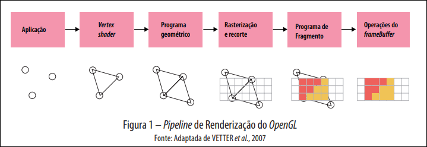

# 3 Modelagem 3D

## OpenGL e Pipeline de Renderização

API multiplataforma para renderização de gráficos 2D e 3D. O _pipeline_ converte processos de _software_ em procedimentos de _hardware_:

1. **Aplicação**: Determina posição de vértices.
2. **Vertex Shader**: Conecta vértices. Local onde matrizes de transformação geométrica (translação, escala, rotação) são aplicadas espacialmente.
3. **Programa Geométrico**: Modifica contexto (ex: espelhamento).
4. **Rasterização e Recorte**: Sobrepõe figura matemática numa matriz de _pixels_.
5. **Fragment Shader**: Atribui cor aos _pixels_ na região visível.
6. **Operações de Framebuffer**: Monta matriz da imagem final.

## Arquivo OBJ

Ferramentas (Blender, Maya) abstraem a matemática dos vértices. O formato `.obj` representa objetos 3D assim:

- `v`: Vértices (coordenadas X, Y, Z).
- `vt`: Vértices de textura (mapeamento 2D).
- `vn`: Vetores normais (cálculo de luz).
- `f`: Faces (índices que conectam os vértices, formando polígonos).

## WebGL

Biblioteca web baseada no OpenGL. Renderiza no `<canvas>` via JavaScript.

- **Buffers**: Arrays que armazenam vértices, cores e índices (`gl.bufferData`).
- **Shaders**:
  - _Vertex Shader_: Multiplica coordenadas pelas matrizes de projeção, câmera e modelo (transformações).
  - _Fragment Shader_: Interpola e define cores dos _pixels_.
- **Animação**: Atualização cíclica de quadros (FPS) mudando valores das matrizes (ex: via `setInterval`).

## Modelagem Procedimental

Geração de modelos 3D via algoritmos e regras matemáticas em vez de modelagem manual.

- Exemplo: Terrenos gerados dinamicamente alterando a altura (Y) dos vértices baseados em algoritmos de ruído (_Perlin Noise_).

## Extrusão e Revolução

Métodos para criar volume 3D a partir de formas 2D.

- **Extrusão**: Duplicar e transladar vértices ao longo de um eixo (ex: plano vira bloco).
- **Revolução**: Rotacionar um perfil 2D ao redor de um eixo criando sólidos de revolução (ex: pino de boliche).
