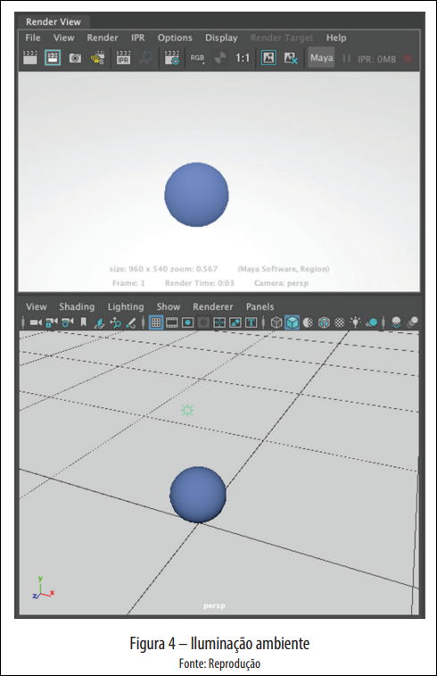
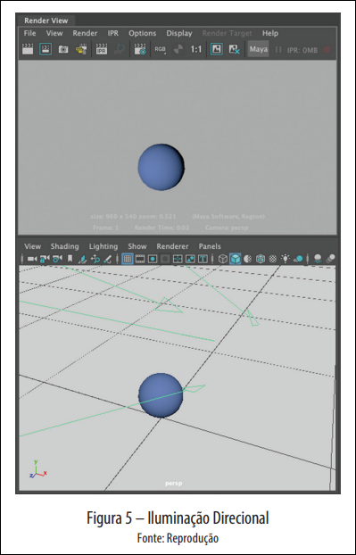
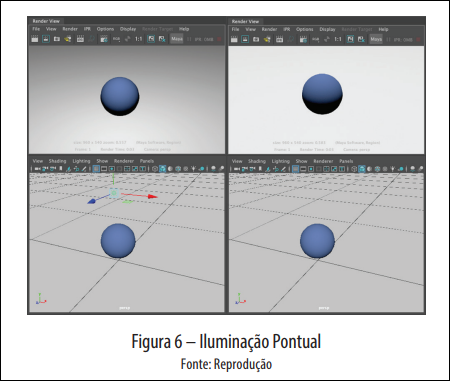
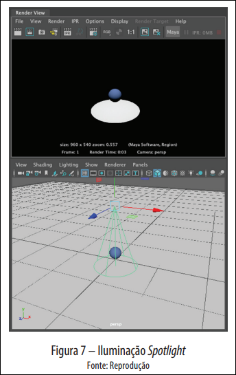
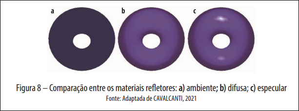
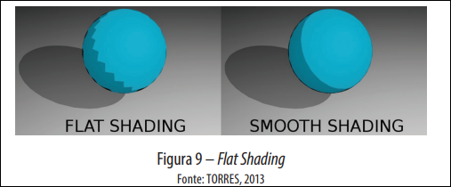
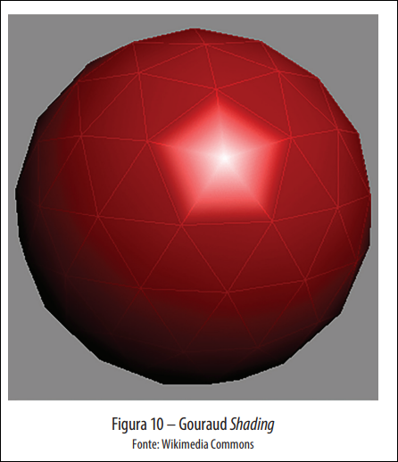

# _Rendering_ e Iluminação

## Modelos de Iluminação em CG

Um Modelo de Iluminação em CG é uma técnica utilizada para calcular a intensidade da cor de um ponto a ser exibido (PINHO, 2021).

Esses modelos levam em consideração:

- Cor do objeto;
- Cor da luz;
- Posição da luz;
- Posição do ponto;
- Posição do observador.

Há 4 grupos diferentes de tipos de iluminação e serão apresentados a seguir.

### Ambiental

Geralmente ilumina toda a superfície do ambiente. Gera iluminação constante para todos os pontos do objeto, dependendo da cor do objeto e da luz para identificar a intensidade da luz em um ponto específico da superfície.

### Direcional

Emitem raios paralelos e de mesma intensidade por todo o ambiente. Utilizadas para simular, por exemplo, raios solares.

Efeito é percebido dependendo da orientação da superfície e pode gerar sombras e reflexos em lados opostos.

### Pontual

Emite luz em todas as direções a partir de um único ponto atingindo os objetos com intensidade e direções diferentes dependendo da distância entre eles. Como exemplo pode se imaginar uma lâmpada no teto.

### _Spotlight_

A fonte é semelhante à iluminação Pontual, mas os raios de luz são emitidos na forma de um cone, apontando para uma direção específica. Por exemplo, o farol de um carro.

## Reflexão

Quanto à emissão, objetos classificam-se como fontes de luz ou refletores.

Modelos de reflexão dividem-se em três categorias: **ambiente**, **difusa** e **especular**.

### Ambiente

Quantidade de luz refletida depende das propriedades da superfície e da luz incidida. Exemplo: luz direcional atinge superfície e reflete com ângulo calculado pela incidência.

Uso comum: rebatedores em estúdios fotográficos para refletir luz em ângulo diferente.

### Refletor Difuso

Luz reflete em várias direções, dependendo das saliências do objeto. Intensidade proporcional à orientação relativa entre incidência e superfície.

Gera efeito de gradiente nos objetos.

### Especular

Ângulo de reflexão igual ao ângulo de incidência. Ocorre em superfícies polidas ou brilhantes. Gera brilho com a cor da luz.

## Sombreamento

Também conhecidos como Tonalização, os Métodos de Sombreamento simulam o efeito de diferentes intensidades de iluminação em um objeto.

### Sombreamento Constante

Cálculo feito uma vez por superfície. Aparência mais blocada. Todos os pontos da superfície recebem mesmo aspecto.

### Sombreamento Gouraud

Cálculo baseado em cada vértice do modelo 3D. Transição suave de tons.

Diferença principal: iluminação calculada pelos vértices das faces, não pela normal da face.

### Phong

Adaptação do Gouraud. Adiciona cálculo dos vetores especulares.

Efeitos mais realistas, porém processo demorado. Renderização mais lenta.

## Ray Tracing

Raio emitido do ponto de vista do observador. Ao interceptar objeto, calcula intensidade de cor no ponto. Se não interceptar, usa cor de fundo.

Suporta materiais transparentes e reflexivos. Ray Tracing segue curso do raio (refração/reflexão) para cor exata.

## Ray Casting

Processo inicial similar ao Ray Tracing: emite raios do observador buscando objetos. Economiza processamento ao não renderizar ambiente inteiro.

Diferença: Ray Casting não é recursivo. Ignora reflexão e transparência. Ideal para processamento rápido (ex: jogos).

## Radiosidade

Calcula energia luminosa saindo de uma superfície (refletida + emitida).

Assume objetos como refletores difusos ideais. Intensidade constante em todas as direções de reflexão. Não depende do ponto de vista do observador. Custo computacional alto.

## Photon Mapping

Algoritmo de iluminação global. Considera refração e reflexão.

Modelo de duas passadas:

1. Raios (fótons) saem das fontes de luz e do observador.
2. Raios conectados para determinar radiância nos pontos.

Muito custoso. Exige condição de parada para evitar sobrecarga.

## Técnicas de Animação 3D

- **Quadro a quadro:** Define poses-chave e tempo de permanência. Interpolação cria quadros intermediários.
- **Cinemática Direta:** Move articulações para determinar posição do atuador (ex: cotovelo e ombro definem posição da mão).
- **Cinemática Inversa:** Move atuador e articulações acompanham. Calcula posições automaticamente respeitando limitações mecânicas. Útil para personagens e elementos conectados.
